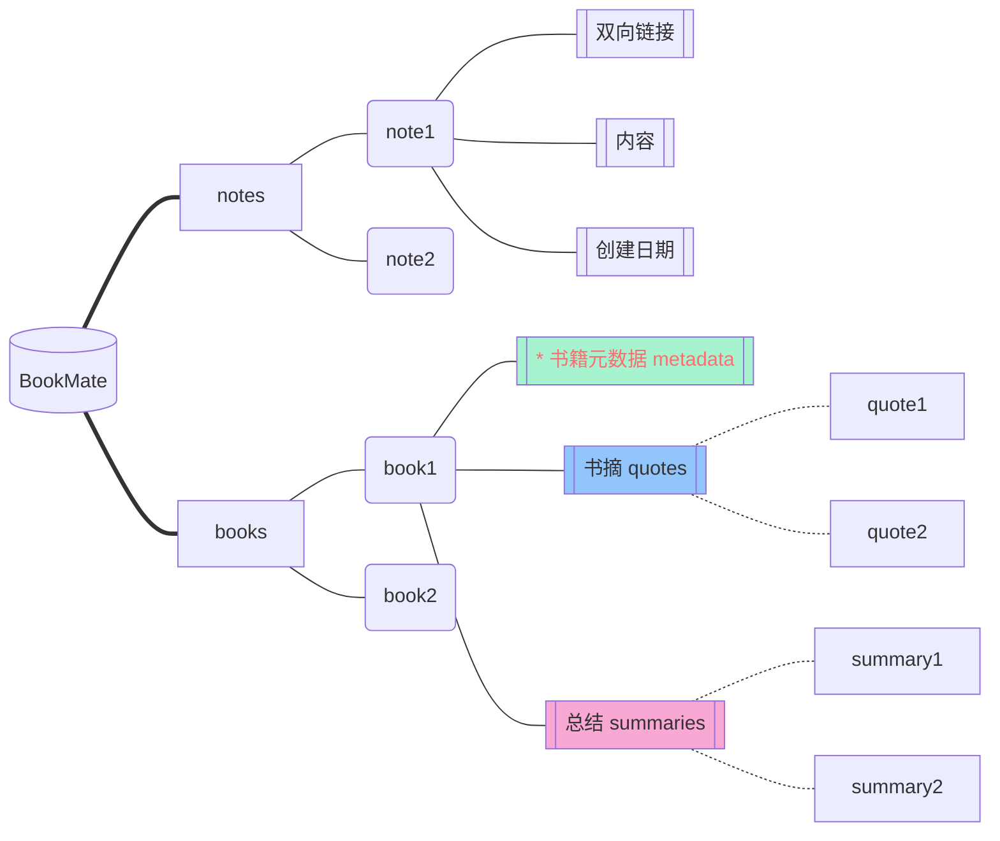
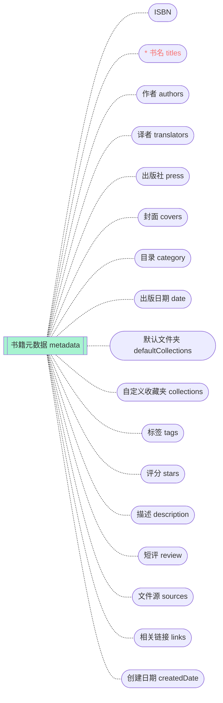
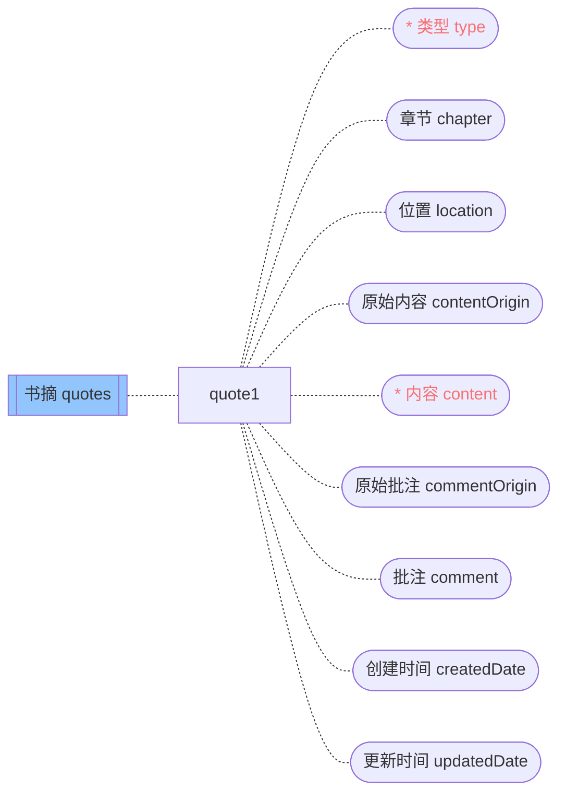
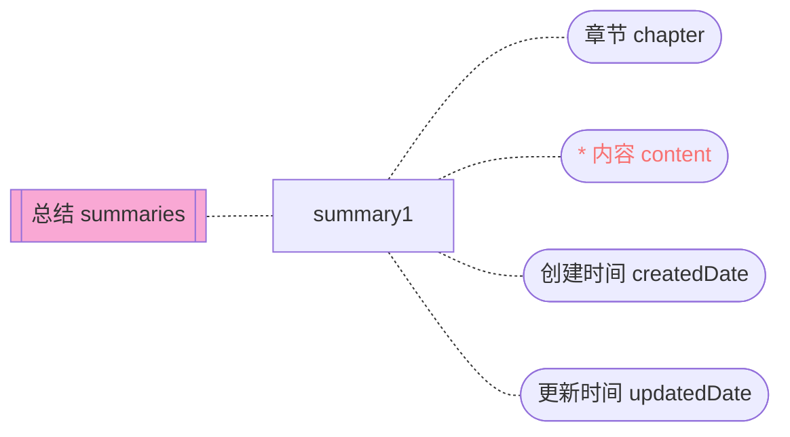

# 数据库结构
使用 MongoDb 作为数据库，数据库的结构如图所示。

:warning: 其中标有 `*` 表示必须字段

```mermaid
graph LR
  root[(BookMate)] === notes[notes]
  root === books[books]

  books --- book1(book1)
  books --- book2(book2)

  notes --- note1(note1)
  notes --- note2(note2)

  note1 --- link[[双向链接]]
  note1 --- noteContent[[内容]]
  note1 --- noteCreatedDate[[创建日期]]

  book1 ---  metadata[[* 书籍元数据 metadata]]
  style metadata fill:#A7F3D0,color: #F87171
  book1 ---  quotes[[书摘 quotes]]
  style quotes fill: #93C5FD
  book1 ---  summaries[[总结 summaries]]
  style summaries fill: #F9A8D4
  
  quotes -.- quote1
  quotes -.- quote2
  
  summaries -.- summary1
  summaries -.- summary2
```

```mermaid
graph LR
  metadata[[书籍元数据 metadata]] -.- isbn([ISBN])
  metadata -.- titles([* 书名 titles])
  style titles color:#F87171
  metadata -.- authors([作者 authors])
  metadata -.- translators([译者 translators])
  metadata -.- press([出版社 press])
  metadata -.- covers([封面 covers])
  metadata -.- category([目录 category])
  metadata -.- date([出版日期 date])
  metadata -.- defaultCollections([默认文件夹 defaultCollections])
  metadata -.- collections([自定义收藏夹 collections])
  metadata -.- tags([标签 tags])
  metadata -.- stars([评分 stars])
  metadata -.- description([描述 description])
  metadata -.- review([短评 review])
  metadata -.- sources([文件源 sources])
  metadata -.- links([相关链接 links])
  metadata -.- createdDate([创建日期 createdDate])
  style metadata fill: #A7F3D0
```

```mermaid
graph LR
 quotes[[书摘 quotes]] -.- quote1

 quote1 -.- type([* 类型 type])
 style type color:#F87171
 quote1 -.- chapter([章节 chapter])
 quote1 -.- location([位置 location])
 quote1 -.- contentOrigin([原始内容 contentOrigin])
 quote1 -.- content([* 内容 content])
 style content color:#F87171
 quote1 -.- commentOrigin([原始批注 commentOrigin])
 quote1 -.- comment([批注 comment])
 quote1 -.- createdDate([创建时间 createdDate])
 quote1 -.- updatedDate([更新时间 updatedDate])
 style quotes fill:  #93C5FD
```

```mermaid
graph LR
 summaries[[总结 summaries]] -.- summary1

 summary1 -.- chapter([章节 chapter])
 summary1 -.- content([* 内容 content])
 style content color:#F87171
 summary1 -.- createdDate([创建时间 createdDate])
 summary1 -.- updatedDate([更新时间 updatedDate])
 
 style summaries fill:  #F9A8D4
```

