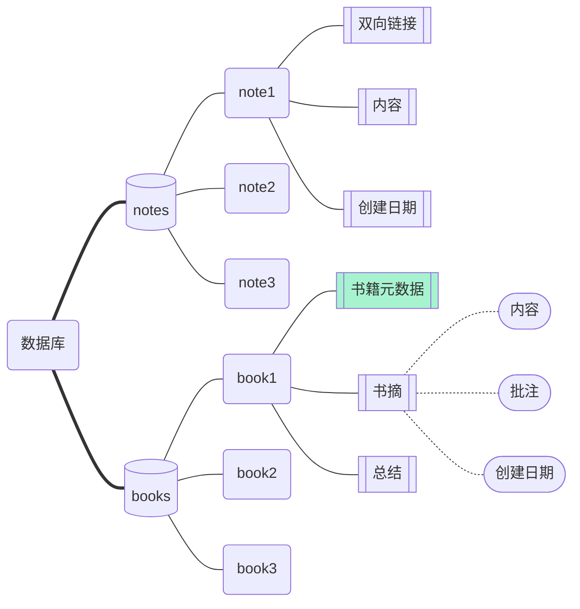
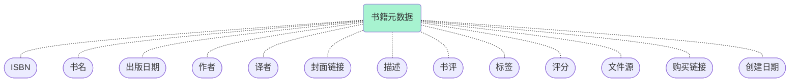

# 数据库结构
使用 MongoDb 作为数据库，数据库的结构如图所示。

```mermaid
graph LR
  root(数据库) === notes[(notes)]
  root === books[(books)]
  
  books --- book1(book1)
  books --- book2(book2)
  books --- book3(book3)
  
  notes --- note1(note1)
  notes --- note2(note2)
  notes --- note3(note3)
  
  note1 --- link[[双向链接]]
  note1 --- noteContent[[内容]]
  note1 --- noteCreatedDate[[创建日期]]

  book1 ---  metadata[[书籍元数据]]
  style metadata fill: #A7F3D0
  book1 ---  quote[[书摘]]
  book1 ---  summary[[总结]]

  quote -.- quoteContent([内容])
  quote -.- comment([批注])
  quote -.- quoteCreatedDate([创建日期])
```

```mermaid
graph TD
  metadata(书籍元数据) -.- isbn([ISBN])
  metadata -.- title([书名])
  metadata -.- date([出版日期])
  metadata -.- author([作者])
  metadata -.- translator([译者])
  metadata -.- cover([封面链接])
  metadata -.- description([描述])
  metadata -.- review([书评])
  metadata -.- tags([标签])
  metadata -.- star([评分])
  metadata -.- source([文件源])
  metadata -.- shop([购买链接])
  metadata -.- bookCreatedData([创建日期])
  style metadata fill: #A7F3D0
```