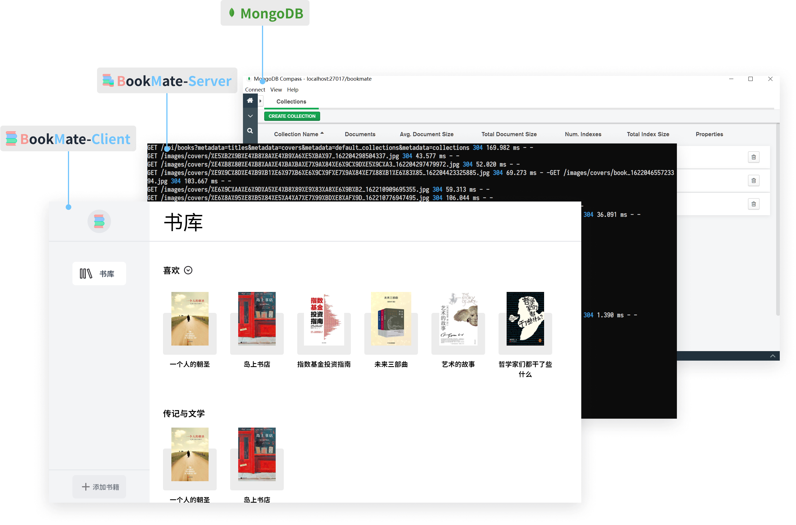

# 简介

Bookmate 是一款遵顼 [MIT 协议](https://github.com/Benbinbin/BookMate/blob/main/LICENSE)的开源书摘管理软件，你可以下载打包好的程序运行在本地，也可以修改[源码](https://github.com/Benbinbin/BookMate)将它部署在任意平台。

BookMate 采用前后端分离设计，由以下 3 部分组成：

* **BookMate-Client** 客户端作为交互界面
* **BookMate-Server** 服务端作为中间桥梁
* **MongoDB** 数据库作为资料存储中心

因此你需要[下载](https://benbinbin.github.io/BookMate/#download)并[安装](./install.md#安装程序)以上相应的 3 部分程序才可以使用 BookMate。由于 BookMate 在本地运行并将所有数据储存在本地，所以用户对数据有完全的掌控权，可以采用喜欢的方式备份数据。