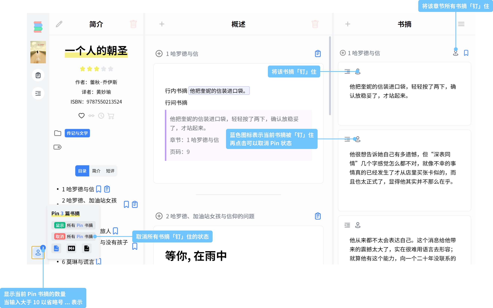
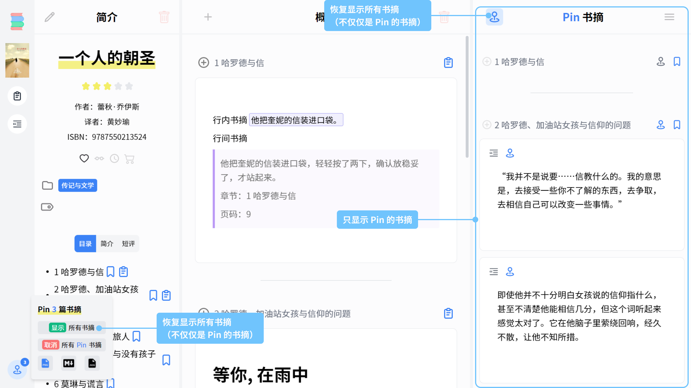
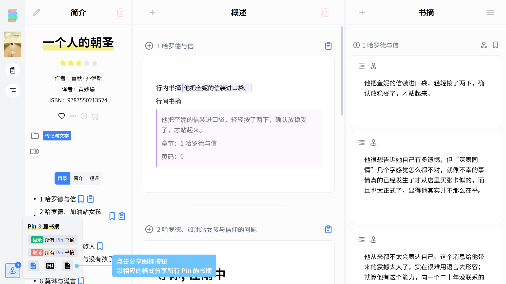

# Pin
Pin 图钉功能对书摘进行批量操作

* 点击书摘卡片左上角的 Pin 图标按钮，可以 「钉」 住该书摘
* 如果书摘 「按章节分类书摘」 模式，则在 「书摘」 栏目章节右侧会有 Pin 图标按钮，也可以用来「钉」住该章节的所有书摘

:bulb: 当书摘被 「钉」 住时， Pin 图标为蓝色，可以再点击 Pin 图标按钮取消书摘被 「钉」 的状态；或点击 「书籍页面」 左下角 Pin 图标按钮，在弹出框中点击 「取消 所有 Pin 书摘」以取消所有书摘「钉」住的状态

## 筛选书摘
点击 「书籍页面」 左下角 Pin 图标按钮，在弹出框中点击 「显示 所有 Pin 书摘」，则 「书摘」 栏目只显示「钉」住的书摘

点击 「书籍页面」 左下角 Pin 图标按钮，在弹出框中点击 「显示 所有书摘」；或者点击 「书摘」 栏目左上角的蓝色 Pin 图标按钮，可以取消只显示「钉」住的书摘（即恢复显示所有书摘）

## 分享书摘
点击 「书籍页面」 左下角 Pin 图标按钮，在弹出框中点击所需的分享图标，以相应的格式分享 Pin 的书摘。

